# QR code generator

This library provides a class which is capable of generating QR codes. It is 
a layer on top of the [ZXing](https://github.com/zxing/zxing) generator
which does the heavily lifting of actually computing the dot matrix. This
lib then adds the functionality to make image files.

This lib is inspired by [QRGen](http://kenglxn.github.io/QRGen/).
But since I'd like to have some structural changes plus more variations when
rendering the QR code, I wrote this new lib instead. The main
differences to QRGen are:
  - you can configure a QrGenerator and then generate multiple QR codes from
    it instead of repeating the configuration for each QR code
  - this lib can overlay a logo over the QR code
  - the 'pixels' of the code can be drawn with different styles
  - you can select from a set of different styles for the three markers (the
    big rectangles in the corners)
  - no leaking of ZXing provided types
  - no support for Android thus only one lib (instead of "core + javase + android")

## Table of contents

* [Introduction](#introduction)
* [Maven](#maven)
* [Configuration](#configration)
    * [Output file type](#conf_filetype)
    * [Size and margin of the code](#conf_size)
    * [Used colors](#conf_colors)
    * [Error correction level](#conf_error)
    * [Logo overlay](#conf_logo)
    * [Styling](#conf_styling)
      * [... the pixels](#conf_styling_pixels)
      * [... the markers](#conf_styling_markers)
    * [Character set of the encoded message](#conf_charset)
* [Actually write the QR code](#write)
* [License](#license)

<a name="introduction"></a>
## Introduction

When starting with class `QrGenerator` usage of this lib is quite
self-explanatory (there's also javadoc available):

```java
    final QrGenerator generator = new QrGenerator()
            .withSize(300, 300)
            .withMargin(3)
            .as(ImageType.PNG)
            .withErrorCorrection(ErrorCorrectionLevel.Q);

    final Path img = generator
            .writeToTmpFile("Hello, World!");
```

<a name="maven"></a>
## Maven

```xml
    <dependency>
        <groupId>com.github.aytchell</groupId>
        <artifactId>qrgen</artifactId>
        <version>2.0.0</version>
    </dependency>
```

<a name="configration"></a>
## Configuration

This section lists the possible configurations for the created QR codes. The
method calls to configure the generator can be chained and the resulting
configuration is collected by the instance. So to make things easier all
examples build on the same instance of `QrGenerator`.

```java
    final QrGenerator generator = new QrGenerator();
```

<a name="conf_filetype"></a>
### Output file type

The file format of the resulting QR code image can be selected to be
`png`, `gif`, `bmp` or `jpeg`:

```java
    generator.as(ImageType.PNG);
```

<a name="conf_size"></a>
### Size and margin of the code

The size of the resulting image (in pixels) can be configured as well
as a "quiet zone" around the code. This margin is an aid for QR code
scanners to easier distinguished the code from the surrounding environment.

The unit of the parameter for the margin's size is "number of dots used in
the QR code" so the actual size of the margin in pixels depends on the size
of the complete image as well as on the complexity of the QR code.

```java
    generator
            .withSize(300, 300)
            .withMargin(3);
```

<a name="conf_colors"></a>
### Used colors

Usually QR codes are displayed in black and white as this gives the best
contrast and thus help a scanner in reading it. But there might be times,
when want to have different colors.

The trivial variant is to set no colors at all then the lib will fall back to
the usual black/white pattern. The next level is to choose a color for
'the background' and another color for 'the pixles':

```java
    final RgbValue daffodil = new RgbValue(0xff, 0xff, 0x31);
    final RgbValue oxfordBlue = new RgbValue(0x00, 0x21, 0x47);

    generator.withColors(daffodil, oxfordBlue);
```

Finally, it is possible to use up to four different colors:
<table style="border: none; border-collapse: collapse">
<tr style="border: none">
<td style="border: none; vertical-align: top; padding: 0">
<ul>
<li>the background color (which is usually white)</li>
<li>the "active parts" of the code (which form 'the pixels' in the mid of the code)</li>
<li>the outer part of the three markers and</li>
<li>the inner part of the three markers</li>
</ul>
</td>
<td style="border: none; vertical-align: center">

</td></tr>
</table>

However, you should choose the colors, so they provide a sufficient contrast.
Otherwise, it might get difficult for QR code scanners to read the code.
  
```java
    final RgbValue white = new RgbValue(0xffffff);
    final RgbValue alloyOrange = new RgbValue(196, 98, 16);
    final RgbValue alabamaCrimson = new RgbValue(0xaf, 0x00, 0x2a);
    final RgbValue black = new RgbValue(0x0);

    generator.withColors(
            black,              // 'pixel' color
            white,              // background color
            alloyOrange,        // outer marker color
            alabamaCrimson);    // inner marker color
```

There's also a version with three parameters where the third color is used
for the complete markers' structure.

As the examples show, an RGB color value can be constructed with the three
parts separated as well as with one single raw integer value. Along with
the `RgbValue` there are some more possible color representations:
  - `ArgbValue` &mdash; an RGB value with a leading alpha channel
  - `RgbaValue` &mdash; same with the alpha channel given at the end
  - `HslValue` &mdash; a color given via hue, saturation and lightness
  - `HslaValue` &mdash; an HSL color value with an extra alpha channel

(Note that only `PNG` and `GIF` output image formats support alpha values.)

<a name="conf_error"></a>
### Error correction level

If you plan to put a logo onto your generated QR code or you're printing it
and the code gets dirty or damaged then information is lost and scanners
might not be able to correctly scan the code.

To circumvent this kind of problem the information encoded into the QR code
can be stored with different degrees of redundancy. The higher the level of
redundancy the better a scanner will be able to read a damaged or covered QR
code but this also means that the QR code becomes more dense ("more pixels").

In the end there is no simple algorithm which level to take but it depends on
the scenario how you want to use the QR code.

The specified levels are
  - L - error correction rate of approximately 7%
  - M - error correction rate of approximately 15%
  - Q - error correction rate of approximately 25%
  - H - error correction rate of approximately 30%

```java
        generator.withErrorCorrection(ErrorCorrectionLevel.Q)
```

<a name="conf_logo"></a>
### Logo overlay

The generator is able to overlay the QR code with a centered logo. The file
format of the logo can be any of `gif`, `png`, `bmp` or `jpeg`. Alpha channel
is respected if the file format supports it.

Note however that the lib does not scale the logo to "fit" (whatever that
means); the logo will cover information from the QR code and increasing the
error correction level should be considered.

It's up to the caller to ensure that the QR code can be read with the
logo above it.

```java
        try (final InputStream logo =
                QrCodeExample.class.getResourceAsStream("github_logo.png")) {
            // in real code check for null ...
            generator.withLogo(logo);
        }

        final Path img = generator
                .writeToTmpFile("Hello, Github!");
```


<a name="conf_styling"></a>
### Styling

It is possible to change the appearance of 'the pixels' used to render the QR
code as well as the appearance of the three markers. Most QR code scanners
should be able to handle these shapes but keep in mind that you're diverging
from 'specified appearance'.

<a name="conf_styling_pixels"></a>
#### ... the pixels

It is possible to change the style of the individual pixels used to render
the QR code. Currently, there are eight different styles available:

  - `RECTANGLES` &mdash; The "standard" styling with rectangular pixels "touching" each other
  - `SMALL_RECTANGLES` &mdash; A styling with smaller pixels so that a white grid betwees them appears
  - `DOTS` &mdash; Dots instead of rectangles
  - `ROUND_CORNERS` &mdash; rectangular pixels but with rounded corners
  - `ROWS` &mdash; a style that makes the pixels appear like rows with morse code like lines
  - `COLUMNS` &mdash; a similar style but with columns instead of rows
  - `SNAKES` &mdash; connected pixels with 'snakes-like' heads when there's no neighbor
  - `WATER` &mdash; connected pixels which behave like adhesion of water surfaces

```java
        final Path img = generator
                .withPixelStyle(PixelStyle.DOTS)
                .writeToTmpFile("Hello, Github!");
```

<table>
<tr>
<td><code>RECTANGLES</code></td>
<td><code>SMALL_RECTANGLES</code></td>
<td><code>DOTS</code></td>
<td><code>ROUND_CORNERS</code></td>
</tr><tr>
<td>

</td><td>
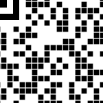
</td><td>
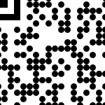
</td><td>
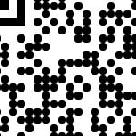
</td></tr></table>

<table>
<tr>
<td><code>ROWS</code></td>
<td><code>COLUMNS</code></td>
<td><code>SNAKES</code></td>
<td><code>WATER</code></td>
</tr><tr>
<td>
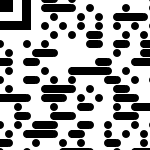
</td><td>
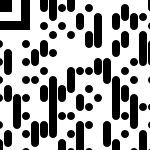
</td><td>
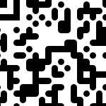
</td><td>
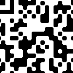
</td></tr></table>

<a name="conf_styling_markers"></a>
#### ... the markers

It's also possible to change the styling of the three big markers.
Currently, there are nine different styles to chose from:

  - `RECTANGLES` &mdash; the 'normal' rectangular markers
  - `ROUND_CORNERS` &mdash; like `RECTANGLES` but with rounded corners
  - `CIRCLES` &mdash; circles instead of rectangles
  - `DROP_IN` &mdash; raindrops appearing to fall toward the inside of the code
  - `DROP_OUT` &mdash; raindrops appearing to fall toward the outside of the code
  - `ROUND_IN` &mdash; rectangular marker with the inner edge being rounded
  - `ROUND_OUT` &mdash; rectangular marker with the outer edge being rounded
  - `EDGE_IN` &mdash; like `ROUND_CORNERS` but the inner edge is a sharp one
  - `EDGE_OUT` &mdash; as above but the outer edge is sharp

<table>
<tr>
<td><code>RECTANGLES</code></td>
<td><code>ROUND_CORNERS</code></td>
<td><code>CIRCLES</code></td>
<td><code>DROP_IN</code></td>
<td><code>DROP_OUT</code></td>
</tr><tr>
<td>
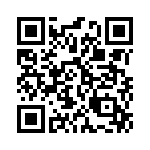
</td><td>

</td><td>
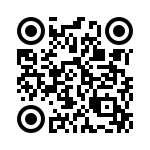
</td><td>

</td><td>
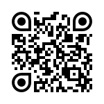
</td></tr></table>

<table>
<tr>
<td><code>ROUND_IN</code></td>
<td><code>ROUND_OUT</code></td>
<td><code>EDGE_IN</code></td>
<td><code>EDGE_OUT</code></td>
</tr><tr>
<td>
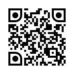
</td><td>

</td><td>
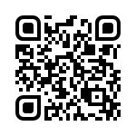
</td><td>
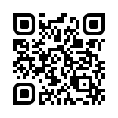
</td></tr></table>

<a name="conf_charset"></a>
### Character set of the encoded message

A QR code encode strings and to be more precise: a series of bytes. And at
this point we're entering the wide area of character encodings. You can
configure the character encoding which should be used when converting the
given payload to bytes.

In most cases UTF-8 (which is the default when not setting any character set)
will be perfectly OK.

```java
        generator.withCharset(StandardCharsets.UTF_8);
```

<a name="write"></a>
## Actually write the QR code

Once you've configured the QR code generator you can use it to write QR
codes. The method to write a payload to a QR code image file does not change
the state of the generator instance. So you can reuse the same generator
instance to write as many QR Code as you like (with different payloads).

```java
        final Path img_1 = generator
                .writeToTmpFile("Hello, World!");

        final Path img_2 = generator
                .writeToTmpFile("Hello again");

        final Path img_3 = generator
                .writeToTmpFile("Anybody out there?");
```

Note that the returned file will be created in the system's tmp folder with
the "delete on exit" flag set. The method does not change access permissions
of the created file so most probably (depending on the JRE and the OS) it will
be readable to anyone with access to the system.

<a name="license"></a>
## License

Apache 2.0 License

Created and maintained by [Hannes Lerchl](mailto:hannes.lerchl@googlemail.com)

Feel free to send in pull requests. Please also add unit tests and adapt the
README if appropriate.
